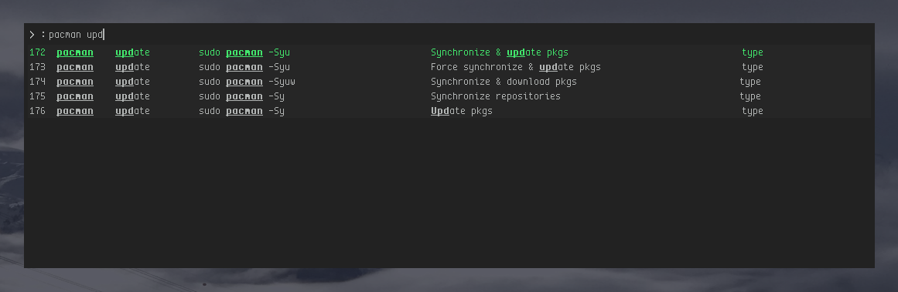

rchst
======

__Dependency__

 * [xdotool](https://www.semicomplete.com/projects/xdotool/)  

__Status__
Not yeat released but functional & usable

Things to to:
* reduce no rofi customization properties
* release official pkg - aur/deb

__What rchst is?__
 * __browser & launcher__ for programmable & automated cheatsheets/cheatfiles - __[.chst](https://github.com/hicolour/.chst)__ actions model defintion that can used be both for key combinations or typing


__What rchst is not?__
* [man](http://www.linfo.org/man.html) replacemnt
* advanced documentation format browser like [zeal](https://github.com/zealdocs/zeal)





rchst how to use:
-----------------

__Manual__

__ARCH__


rchst about itself:
-----------------

PDF or HTML cheatsheets are not very usable and therfe is strong need for interactive easly searchable cheatsheets.
As simple as possible, text based cheatsheets are the fundamenetal building block of final solution.

Key priciples:
 - Single line & simple command
 - Single line, simple & easy searchable intuitive description

This is not inteded to be few-lines per command, or documentation style formart.

.chst format/model was orginaly designed mainly for [rofi](https://github.com/DaveDavenport/rofi) - a window switcher & application launcher, simply more advanced dmenu -  and its extension [rchst](https://github.com/hicolour/rchst).

Format is more or less generic and can be used by any type of software that will be able to cosume it as a source of commands or key combinanations cheatsheets.

rchst alternatives
-----------------
.chst browsers & launchers:
Planned:
- [dchst](https://github.com/hicolour/dchst) __launcher style browser__ - just a tiny [dmenu](https://github.com/DaveDavenport/rofi) extension
- [fchst](https://github.com/hicolour/fchst) __console style browser__ - just tiny command line [fzf](https://github.com/junegunn/fzf) extension


Documenenation helepers:
- [man](http://www.linfo.org/man.html)
- [zeal](https://github.com/zealdocs/zeal)


Supported .chst file format and its versions
--------

Currently rchst supports first draft version of .chst file format:


| File format version              | Format Defintion                                                           |
| -------------------------------- |:-------------------------------------------------------------------------:|
| `0.0.1`                          | ```Category =\|= Subcategory =\|= Command =\|= Description =\|= Action Type```|


Command & Action Type
-----------------
How ```Comamnd``` are interpreted depends on ```Action Type```  

Currently there are four action types:

 - ```key``` - inform .chst browser that command should be executed as key press  
 - ```type```- inform .chst browser that command should be executed just by regular letter typing (e.g. in previously focued window/console)
 - ```input+key``` - inform .chst browser that command should be executed as key press, but before that browser should ask user for input parameters defined in command
 - ```input+type``` - inform .chst browser that command should be executed just by regular letter typing, but before that browser should ask user for input parameters defined in command   

__Currently rchst does not yet support providing input values__


If the ```key``` action type is used, command should contains key combination that is based on the X Keysym strings e.g.
```
Super_l+n

```


If the ```type``` action type is used, command can conatins any text e.g.
```
git status
```

Roadmap
-----------------
- Create/Update/Delete actions
- Support for inputs gathering
